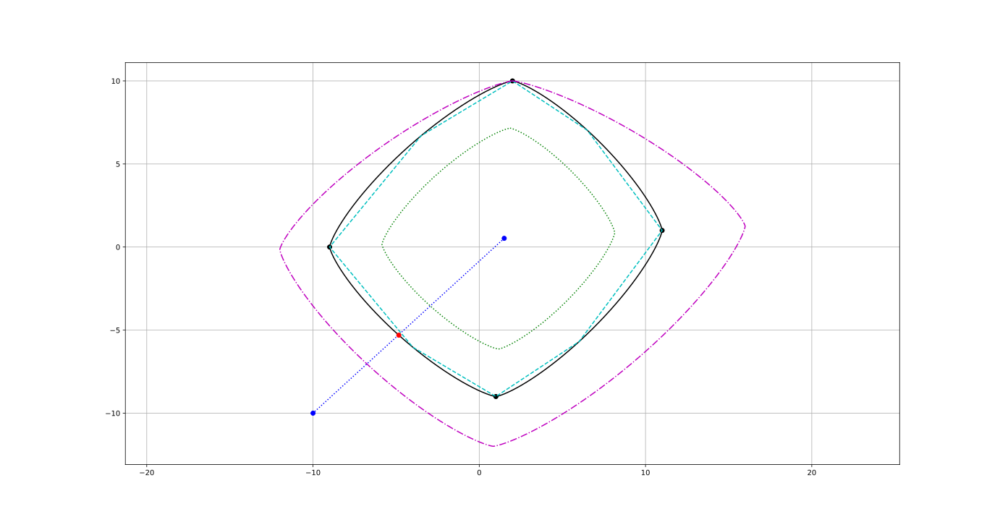

# limit_handler_cpp
This library provides helper functions to evaluate and manipulate diamond acceleration constraints with elliptic connections. An example for the usage is given [here](./src/example.cpp).

The library includes the following functions:

| Function | Description |
| -------- | ---------------------------- |
| `pt_within_limits` | Checks if a provided acceleration input lies within the limits |
| `get_max_ax_from_ay` | Returns the maximum ax acceleration based on the provided ay_value |
| `center_of_limit_shape` | Get the center point of the limit shape |
| `cut_off_at_limits` | Returns closest point on the limit for a point outside the limits |
| `scale_constraint_point` | Scales the Constraints with the provided scaling input. Scaling of 1.0 results in the same output |
| `constraint_point_with_margin` | Adds a margin to the provided constraint input. Margin of 0.0 results in the same output. |
| `constraints_with_margin` | Adds margin to a Trajectory of constraint points |
| `interp_control_constraint_point` | Returns a Polygon of size n_target, that interpolates the provided limit shape |
| `interp_control_constraints` | Interpolates a Trajectory of constraint points |
